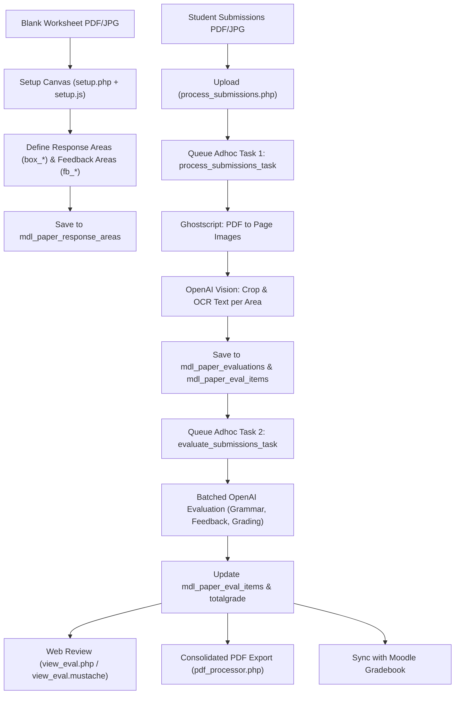

# mod_paper Developer & Architecture Guide

A comprehensive architectural and development reference for the **`mod_paper`** Moodle activity plugin.

---

## 1. Overview & Purpose

`mod_paper` allows teachers to scan paper worksheets or written student submissions (PDF or JPG), automatically detect and extract student responses using OCR/Vision bounding boxes, and generate automated AI-powered grammar corrections, feedback comments, and numerical grades via OpenAI (GPT-4o).

Teachers can review, manually adjust AI evaluations, and export a consolidated evaluation PDF with corrections and feedback positioned directly on the worksheet.

---

## 2. Core Architecture & Workflow Pipeline



### The 2-Stage Decoupled Pipeline
The submission workflow is split into two distinct background adhoc tasks:
1. **Stage 1 (`process_submissions_task.php`)**: Converts submitted multi-page PDFs into image slices using Ghostscript, crops the response areas based on percentage bounding boxes, and performs OCR text extraction via OpenAI Vision.
2. **Stage 2 (`evaluate_submissions_task.php`)**: Batches response texts to OpenAI for grammar corrections, custom qualitative feedback, and numerical scoring.
*Benefit:* Teachers can adjust prompts or click **Re-evaluate** (`re_evaluate.php`) to re-run AI evaluation without needing to re-upload or re-OCR images.

### Parallel AI Requests (`curl_multi`)

OCR is the pipeline's bottleneck: a batch costs **pages × response areas** separate Vision requests, and each one must carry its own image crop, so they cannot be collapsed into a single prompt the way stage-2 grading is. Both stages therefore fan their requests out concurrently through `openai_handler::call_openai_multi()`.

- **Runner**: a `curl_multi` loop with a queue capped at `mod_paper/openaiconcurrency` (default 16), waiting on `curl_multi_select()` rather than busy-looping. Handles map back to caller keys via `spl_object_id()` (PHP 8 returns `CurlHandle` objects, so they can't be cast to int). This is a local implementation rather than Moodle core's `\curl::multi()` — see below.
- **`submission_processor::process_batch()` runs in three phases**: (1) `build_crop_jobs()` decodes each page **once** and writes every crop to a temp file; (2) `run_ocr_jobs()` sends them all concurrently, base64-encoding each crop lazily so peak memory tracks requests in flight, not batch size; (3) `save_ocr_jobs()` writes the rows in page → `responsenumber ASC` order. Phase 3 ordering is **required**: `apply_name_field()` writes to the shared `paper_evaluations` row, so multi-name-field last-wins is only deterministic if the writes are ordered even though the OCR was not. The `paper_evaluations` row is also created in phase 3, not up front, so `external_api::check_status()`'s progress count keeps climbing.
- **`evaluation_processor::process_paper()`** collects all areas first, then grades them in one fan-out via `batch_process_evaluations_multi()`.

**Failure handling is deliberately status-aware.** The runner inspects `curl_multi_info_read()` errno and HTTP status, retries only transient failures (connection errors, 429, 5xx) over two backoff rounds, treats an undecodable body as an error rather than empty text, and guarantees one result entry per input key. Callers get an explicit `error` per key and never conflate it with an empty answer — a failed OCR still writes its `paper_eval_items` row (with empty `ocrtext`) rather than dropping it, which would otherwise hide the area from the review page and silently shrink `totalgrade`.

Related settings: `mod_paper/openaiconcurrency` and `mod_paper/openaitimeout` (per-request seconds, default 120; a connect timeout of 10s is fixed in code).

---

## 3. Database Schema

All tables use the `paper_` prefix:

### `mdl_paper` (Activity Instances)
| Field | Type | Description |
| :--- | :--- | :--- |
| `id` | INT(10) PK | Primary key |
| `course` | INT(10) | Course ID |
| `name` | VARCHAR(255) | Activity instance name |
| `intro` / `introformat` | TEXT / INT(4) | Activity description |
| `namefieldrole` | VARCHAR(20) | Matching role (`username` or free text) |
| `targetlanguage` | VARCHAR(50) | Target language (e.g. `English`, `ja-JP`) |
| `targetlanguagefont` | VARCHAR(50) | Font used for target language (default `freemono`) |
| `feedbacklanguage` | VARCHAR(50) | Language for feedback |
| `feedbacklanguagefont` | VARCHAR(50) | Font used for feedback text (default `freeserif`) |
| `grade` | INT(10) | Maximum grade (default 100) |
| `showtotalscore` | INT(2) | Flag (0/1) whether to print total score on evaluation |
| `alignoffsetx` | NUMBER(10,4) | Scan alignment horizontal offset, **millimetres**. NULL inherits the site default |
| `alignoffsety` | NUMBER(10,4) | Scan alignment vertical offset, **millimetres**. NULL inherits the site default |
| `alignscalex` | NUMBER(10,4) | Scan alignment horizontal scale, **percent** (100 = no stretch). NULL inherits the site default |
| `alignscaley` | NUMBER(10,4) | Scan alignment vertical scale, **percent** (100 = no stretch). NULL inherits the site default |

### `mdl_paper_response_areas` (Template Bounding Boxes & Prompts)
| Field | Type | Description |
| :--- | :--- | :--- |
| `id` | INT(10) PK | Primary key |
| `paperid` | INT(10) FK | Reference to `mdl_paper.id` |
| `responsenumber` | INT(10) | Area index (1, 2, 3...) |
| `areatype` | INT(2) | Role of this area — see the table below (`mod_paper\constants::M_AREATYPE_*`) |
| `box_x`, `box_y`, `box_w`, `box_h` | DECIMAL(10,2) | Response bounding box coordinates (% of page width/height) |
| `fb_x`, `fb_y`, `fb_w`, `fb_h` | DECIMAL(10,2) | Independent feedback area bounding box coordinates |
| `question` | TEXT | Question prompt / instructions |
| `correctanswer` | TEXT | Model or target correct answer |
| `correctanswermode` | VARCHAR(50) | `none`, `exactly`, `relevant`, `samemeaning` |
| `grammarcorrections` | VARCHAR(50) | `no`, `major`, `all` |
| `feedbackmode` | VARCHAR(20) | `none`, `grammatical`, `custom` |
| `feedbackinstructions` | TEXT | Custom prompt instructions for AI feedback |
| `gradingmode` | VARCHAR(20) | `none`, `incorrect`, `overall` |
| `maxgrade` | DECIMAL(10,2) | Max points for this response area |
| `gradeinstructions` | TEXT | Custom prompt instructions for AI grading |
| `responsefont` | VARCHAR(50) | Font for this area's student text — see below |
| `feedbackfont` | VARCHAR(50) | Font for this area's feedback text — see below |

#### Per-area fonts (`responsefont` / `feedbackfont`)

The activity-level `targetlanguagefont` / `feedbacklanguagefont` decide the font for *all*
student text and *all* feedback respectively, which breaks down as soon as one area holds a
different script from the rest — a name written in Japanese printed in a Latin-only font
comes out of TCPDF as `???`. Each area can therefore override its own two fonts.

Both columns hold either a literal font key from `utils::get_font_options()`, or one of two
sentinels: `constants::M_FONT_TARGET` (`'target'`) and `constants::M_FONT_NATIVE`
(`'native'`), meaning "inherit the activity's target/native language font". The sentinels are
the defaults (`target` for `responsefont`, `native` for `feedbackfont`), and they are stored
rather than resolved at save time, so changing the activity's fonts still carries through to
every area that did not opt out.

Never read these columns directly — call `utils::get_response_font($area, $paper)` and
`utils::get_feedback_font($area, $paper)`, which resolve the sentinels and fall back to
`constants::M_FONT_FALLBACK` if the stored font is not one we can honour. That validation
covers the *activity-level* fonts too, not just the per-area ones, because TCPDF fatals on a
font definition file it cannot include rather than falling back on its own.
`utils::get_area_font_options($paper)` builds the select list, labelling the sentinels with the
font they currently resolve to.

#### The font list (`utils::get_font_keys()`)

Only fonts Moodle actually ships in `lib/tcpdf/fonts/` may be listed. Initially `cid0kr` was offered for
Korean until it turned out Moodle does not ship it — picking it threw
`TCPDF ERROR: Could not include font definition file: cid0kr`. Korean is `hysmyeongjostdmedium`.

The list splits three ways, which is what the option labels are trying to convey:

| Group | Fonts | Embedded? | Coverage |
| :--- | :--- | :--- | :--- |
| GNU FreeFont | `freeserif`, `freesans`, `freemono` | Yes | FreeSerif is the widest — Arabic, Hebrew, Cyrillic, Greek, Thai, Devanagari, Tamil. FreeSans has **no** Arabic/Thai/Tamil; FreeMono no Thai/Tamil/Devanagari. |
| PDF core 14 | `courier`, `helvetica`, `times` | No (assumed present) | Western only — non-Latin comes out as `?`. |
| CJK CID-0 | `kozminproregular`, `kozgopromedium`, `stsongstdlight`, `msungstdlight`, `hysmyeongjostdmedium` | No | Glyphs are **not** embedded; the reader needs the font. |

Defaults are `freemono` for the target language and `freeserif` for the native one
(`settings.php`, mirrored as `?:` fallbacks in `mod_form.php`). FreeMono was chosen over Courier
because its Latin output is visually identical while it also covers Arabic/Hebrew/Cyrillic/Greek,
and being embedded it renders the same in every viewer. Changing these defaults only affects new
activities — existing `paper` rows keep their stored font, and an existing site keeps its stored
admin setting until someone changes it.

Two rendering caveats worth knowing before chasing a "bug":

- **CID-0 fonts** put correct UniJIS-UCS2-H character codes in the PDF but need a viewer with
  the matching CJK font. Rasterising with a Ghostscript build lacking the Adobe-Japan1 resources
  gives substituted Latin glyphs even though the file is correct — check in a real PDF viewer,
  not via `gs`.
- **Complex scripts.** TCPDF does Arabic contextual shaping and bidi automatically and gets it
  right. It has *no* Indic shaping, so Devanagari/Tamil render with visible viramas instead of
  proper conjuncts — legible, but typographically wrong, and no font choice fixes it. Arabic in a
  monospace font (`freemono`) is shaped but visually disconnected, since each letter is forced
  into its own cell; an Arabic-target activity wants `freeserif`.

#### Area types (`areatype`)

Declared as `mod_paper\constants::M_AREATYPE_*`. Almost no code compares these values
directly — use the predicates on `mod_paper\utils` (`is_graded_area()`, `is_name_area()`,
`is_displayonly_area()`, `has_ocr_text()`) so a new type does not mean re-auditing every
call site. 

| Value | Constant | OCR? | Correction / feedback / grade | Notes |
| :--- | :--- | :--- | :--- | :--- |
| 0 | `M_AREATYPE_GRADED` | Yes | Yes | Standard response area. The only type that contributes to `maxgrade` totals and the printed total score. |
| 1 | `M_AREATYPE_NAME` | Yes | No | Free-text student name; written to `paper_evaluations.studentnametext`. Bottom-aligned when printed. |
| 2 | `M_AREATYPE_USERNAME` | Yes | No | As above, and matched against `user.username` to set `paper_evaluations.userid`. |
| 3 | `M_AREATYPE_DISPLAYONLY` | No | No | Cropped wide (`utils::pad_box()`), saved as a `responsesnippet` image and reproduced as an image rather than text. |
| 4 | `M_AREATYPE_UNGRADED` | Yes | No | Handwriting is read and printed back verbatim. Behaviour beyond this is not implemented yet. |

### `mdl_paper_evaluations` (Per-Submission Master Record)
| Field | Type | Description |
| :--- | :--- | :--- |
| `id` | INT(10) PK | Primary key |
| `paperid` | INT(10) FK | Reference to `mdl_paper.id` |
| `userid` | INT(10) | Matched Moodle User ID (or null) |
| `studentnametext` | VARCHAR(255) | OCR'd student name string |
| `totalgrade` | DECIMAL(10,2) | Computed total grade |
| `filename` | VARCHAR(255) | Original submitted file name |

### `mdl_paper_eval_items` (Per-Response-Area Results)
| Field | Type | Description |
| :--- | :--- | :--- |
| `id` | INT(10) PK | Primary key |
| `evalid` | INT(10) FK | Reference to `mdl_paper_evaluations.id` |
| `responseareaid` | INT(10) FK | Reference to `mdl_paper_response_areas.id` |
| `ocrtext` | TEXT | Raw OCR'd student response text |
| `correctedtext` | TEXT | AI grammar-corrected version |
| `feedback` | TEXT | Qualitative AI feedback string |
| `itemgrade` | DECIMAL(10,2) | Numerical score awarded for this item |

### `mdl_paper_grading_presets` & `mdl_paper_feedback_presets`
Reusable system and teacher presets for grading criteria and feedback prompts (`id`, `userid`, `name`, `content`, `timecreated`, `timemodified`). These are user-level, not tied to any `paperid`, so they are intentionally **not** included in activity backup/restore — the text they contributed already lives in `paper_response_areas`' own instruction fields once applied.

---

## 3a. Backup & Restore (`backup/moodle2/`)

Every activity module must ship a `backup_MODNAME_activity_task`/`restore_MODNAME_activity_task` pair or Moodle's `backup_factory`/`restore_factory` fatal when duplicating, backing up, or restoring the activity (this was previously missing entirely — course/activity duplication was broken). `backup_paper_stepslib.php` backs up `paper` and `paper_response_areas` unconditionally (template config, not personal data), and `paper_evaluations`/`paper_eval_items` only when the "include user data" setting is on (they're per-student submissions, mirroring how other modules gate submission data). `paper_eval_items.responseareaid` and `paper_evaluations.userid` are id-annotated so restore remaps them correctly into a new course/site. File areas `intro`, `template` (single worksheet image, itemid 0) and `responsesnippet` (per `paper_eval_items.id`) are backed up; the `submissions` filearea (raw uploaded scan batches, keyed by an ephemeral `batchid` no DB row references after processing) and `downloadevaluations` (generated on-the-fly by `pdf_processor`, not a stored file) are deliberately excluded.

---

## 3b. Deletion, Course Reset & File Cleanup

Files outlive rows unless something deletes them: `responsesnippet` and `areacrop` are keyed by
`paper_eval_items.id`, and `submissions` by an ephemeral batch id that no row references once
processing finishes. Deleting an eval item on its own therefore orphans files permanently.
Two `lib.php` helpers own that cleanup, and every delete path goes through one of them:

- **`paper_delete_evaluation($evaluation, $context)`** — one evaluation, its items, and those
  items' files (`constants::M_ITEM_FILEAREAS`). Used by `delete_eval.php`.
- **`paper_delete_all_evaluations($paper, $context)`** — every evaluation for one paper, and
  all of `constants::M_USERDATA_FILEAREAS` wholesale. Used by `delete_all_evals.php` and by
  the course reset.

Neither touches `paper_response_areas` or the `template` file area: those are the worksheet's
configuration, not student data, and survive a reset exactly as the backup treats them
(unconditionally backed up, versus evaluations being gated on "include user data").

**Course reset** is implemented by the four standard callbacks — `paper_reset_userdata()`,
`paper_reset_course_form_definition()`, `paper_reset_course_form_defaults()` and
`paper_reset_gradebook()`. A module missing the first two is listed under "not supported" on the
course reset page and silently keeps all its data through a reset, which is what mod_paper did
before these existed. `paper_reset_userdata()` falls back to deleting rows only if a paper has no
course module (hence no context, hence no files to clear).

**Activity/course deletion needs no plugin code for files.** `course_delete_module()` calls
`$fs->delete_area_files($modcontext->id)` immediately after `paper_delete_instance()`, and
`remove_course_contents()` deletes the module contexts, which does the same. So every file area
in the module context goes automatically; `paper_delete_instance()` only has to clear the
database rows, which is why it does not repeat the file deletion.

---

## 4. Key Components & Directory Map

```
public/mod/paper/
├── backup/moodle2/
│   ├── backup_paper_activity_task.class.php    # Registers the paper backup step
│   ├── backup_paper_stepslib.php               # Defines backup XML structure + file/id annotations
│   ├── restore_paper_activity_task.class.php   # Registers the paper restore step
│   └── restore_paper_stepslib.php              # Rebuilds tables/FKs and re-attaches files on restore
├── amd/src/
│   ├── setup.js            # HTML5 Canvas UI for drawing & configuring response/feedback boxes
│   ├── view_eval.js        # Interactive teacher review page (live inline editing & recalculation)
│   ├── alignment.js        # Evaluation PDF preview on the scan alignment page
│   ├── constants.js        # Shared enum values, mirroring classes/constants.php
│   └── reports.js          # Submissions list table handling and bulk actions
├── classes/
│   ├── ai_manager.php      # Abstraction layer for AI providers
│   ├── openai_handler.php  # GPT-4o API client (Vision OCR, batch evaluation, prompt structuring)
│   ├── pdf_processor.php   # Ghostscript PDF->JPG slicing & TCPDF evaluation PDF generation
│   ├── diff.php            # Word-level diff engine (character/word matching)
│   ├── utils.php           # Diff formatting, font mappers, preset helpers, box coordinate geometry
│   ├── task/
│   │   ├── process_submissions_task.php   # Adhoc task: PDF bursting, cropping, OCR
│   │   └── evaluate_submissions_task.php  # Adhoc task: Batched AI grading and feedback
│   └── form/
│       ├── preset_form.php                # Grading preset add/edit form
│       ├── feedback_preset_form.php       # Feedback preset add/edit form
│       └── process_submissions_form.php   # Multi-file submission upload form
├── templates/
│   ├── view_page.mustache                 # Teacher/Student main view page
│   ├── setup.mustache                     # Worksheet configuration canvas layout
│   ├── reports_page.mustache              # Submissions report list
│   ├── view_eval.mustache                 # Single submission review & edit interface
│   └── eval_item_content.mustache         # Item-level diff & feedback rendering block
├── samples/
│   ├── test_worksheet.pdf                 # Sample blank worksheet template
│   └── test_worksheet_submissions.pdf     # Sample multi-page completed student worksheets
├── alignment.php           # Scan alignment correction page, with a live evaluation preview
├── presets.php             # Preset manager page for grading and feedback templates
├── process_submissions.php # Submission upload handler and background task dispatcher
├── re_evaluate.php         # Re-evaluation trigger endpoint
├── reports.php             # Submissions report page
├── setup.php               # Template area setup page
├── view_eval.php           # Individual evaluation review and manual editing controller
├── developer.php           # Inspection tools; gated behind the debug features setting
├── settings.php            # Admin global plugin settings (API key, ghostscript path, font defaults)
└── mod_form.php            # Activity instance creation form
```

---

## 5. UI & Rendering Engine

### A. Setup Canvas (`amd/src/setup.js`)
- Uses HTML5 `<canvas>` overlaid on top of the worksheet JPG.
- Supports dual bounding boxes per item:
  - **Red Bounding Box (`box_*`)**: Response area for student handwriting/text OCR.
  - **Blue/Green Bounding Box (`fb_*`)**: Dedicated location where feedback text is written on the final PDF.
- If no custom feedback box is drawn, `utils::get_effective_feedback_box()` defaults to positioning the feedback below or adjacent to the response box.

### B. Grammar Corrections Diff (`classes/diff.php` & `classes/utils.php`)
- Computes word-level diffs between raw OCR text and corrected text.
- Generates HTML with red strikethrough (`<span class="paper_del">`) for mistakes and green bold (`<span class="paper_ins">`) for corrections.

### C. Review Sidebar (`view_eval.php` + `amd/src/view_eval.js`)
Clicking a response area on the worksheet opens an editing sidebar backed by two web service calls in `classes/external/external_api.php`:

- **`mod_paper_update_eval_item`** saves grade, original (OCR) text, corrected text and feedback. Both texts are editable: the printed correction is `utils::build_combined_diff($ocrtext, $correctedtext)`, so a misread word would otherwise show up as a correction the student never needed. Sending `ocrtext` as `null` leaves the stored text untouched, which is what a display-only area (no OCR text of its own) does.
- **`mod_paper_reevaluate_eval_item`** is the single-item counterpart of `re_evaluate.php`: it puts one item back into the pending state (NULL `correctedtext`/`feedback`/`itemgrade`), then calls `evaluation_processor::evaluate_area()` **synchronously** rather than queueing the adhoc task, so the teacher sees the new result immediately. Any OCR text sent with the call is saved first, so an unsaved sidebar fix is what gets graded. If the AI returns nothing the item is deliberately left pending, so the next scheduled evaluation run retries it. `evaluate_area()` reports progress with `mtrace()`, which echoes into the response body outside CLI — the call is wrapped in `ob_start()`/`ob_end_clean()` to keep it out of the JSON.

Grades are held to the response area's `maxgrade` in both places: `view_eval.php` passes it through as `data-maxgrade` for the `max` attribute on the input, and `external_api::clamp_grade()` clamps server-side, since a web service cannot trust the widget. A NULL `maxgrade` (only possible on rows not created by `setup.php`) means no maximum was ever configured and is left uncapped.

Editing a name/username area writes back to `paper_evaluations.studentnametext`, falling back to the OCR text when there is no corrected text — name areas never reach stage 2, so the teacher's fix normally lands in the OCR box. A corrected username re-links `paper_evaluations.userid`, the same way `submission_processor::apply_name_field()` does on first OCR.

### D. PDF Generation (`classes/pdf_processor.php`)
- Uses TCPDF loaded via Moodle core.
- Loads the original blank worksheet background image.
- Prints student name at top.
- Writes corrected text and feedback inside designated bounding boxes (`fb_*`), each in the font `utils::get_response_font()` / `utils::get_feedback_font()` resolves for that area (see "Per-area fonts" above) rather than one font for the whole page.
- `draw_grade_badge()` puts each item's score in a green rounded outline just outside the response area's right edge, level with the top of the box. It widens for a longer score and is pulled back onto the page if the area runs out to the right margin.

### E. Scan Alignment (`alignment.php` + `amd/src/alignment.js`)
Corrects for displacement between the worksheet as printed and as scanned back in, which
decides where display-only snippets are cut from their stored crops. Alongside the form sits a
live preview: an `<iframe>` pointed at the `downloadevaluations` pluginfile URL for one chosen
evaluation. That PDF is generated per request, so the preview shows current output — including
changes made elsewhere, such as fonts set on `setup.php` — and saving redirects back to this
page rather than to `reports.php` so the teacher can iterate without leaving. The chosen
evaluation rides along on every redirect as `previewevalid`. `alignment.js` swaps the frame
`src` when the student selector changes and appends a `cachebust` parameter, since a browser's
PDF viewer will otherwise happily re-show what it already has for an unchanged URL.

**Units — the four values are not all in the same one.** The offsets are millimetres on the
printed A4 page, so they can be compared with the `croppadmm` margin that bounds them and
measured against a print-out with a ruler; the scales are percentages, because a ratio has no
millimetre equivalent. Everything downstream of the settings works in page percentages, so
`utils::window_snippet()` converts the offsets via `constants::M_PAGE_W_MM`/`M_PAGE_H_MM`, and
`alignment_detector::detect()` converts its fit back the other way before reporting. Those are
the only two conversion points — `utils::get_scan_alignment()` returns storage units unchanged.
The offsets were originally page percentages (upgrade step `2024042716` converted them), which
was unusable in practice: the same "1%" meant 2.1mm across and 3mm down, and neither could be
compared with a margin quoted in millimetres.

---

### F. Developer Tools (`developer.php`)

Off unless the `enabledebugfeatures` admin setting is on — check it via
`utils::debug_features_enabled()`, never by reading the config directly. The setting hides the
Developer button on `reports.php` *and* guards the page itself, since hiding a button leaves the
URL working. `savedebugcrops` is the related setting that decides whether there is anything
extra for the page to show.

## 6. Past Development History & Conversation Log

When referencing past work or decisions, use these Conversation IDs from the history:

| Date | Conversation ID | Key Milestones & Implemented Features |
| :--- | :--- | :--- |
| **2026-04-18** | `5c60f52c-ce26-42f9-a3e8-bd985a320d01` | **Pipeline Separation**: Decoupled OCR upload from AI evaluation into two adhoc tasks. Added PDF upload in setup. Implemented batched OpenAI evaluation. |
| **2026-04-26** | `cfe7db2c-1c89-47e3-a84c-87156557ceb3` | **Configurable Fonts & Status Icons**: Added `targetlanguagefont` and `feedbacklanguagefont` (Courier, FreeSans, Helvetica, Times, KozMinProRegular, STSongStdLight). Added response area setup status indicators. |
| **2026-04-27** | `5fb25941-f177-4f7f-b668-b200536ff61f` | **Web Service API Fix**: Resolved namespace and inheritance with `external_api`. |
| **2026-04-27** | `2642e3c4-25da-48dc-8934-2989c06d1835` | **Grading/Feedback Refactor & Mustache Migration**: Separated `gradingmode` from `feedbackmode`. Added preset grading prompts. Migrated `view.php`, `reports.php`, and `view_eval.php` to Mustache templates. Added teacher live score editing. |
| **2026-04-28** | `860bae78-059c-46dc-a371-836b17f433db` | **Feedback Presets & Feedback Boxes**: Created `paper_feedback_presets` table and management UI. Added independent feedback bounding boxes (`fb_*`) in setup canvas and PDF renderer. |

---

## 7. Developer Cheatsheet & CLI Commands

### Run Adhoc Tasks Manually
To execute queued submission processing or evaluation immediately without waiting for cron:
```bash
# Process uploads, burst PDF, crop, and run OCR
php public/admin/cli/adhoc_task.php --execute=\\mod_paper\\task\\process_submissions_task

# Run AI evaluation, feedback generation, and grade calculation
php public/admin/cli/adhoc_task.php --execute=\\mod_paper\\task\\evaluate_submissions_task
```

### Compile AMD Javascript
When modifying files in `amd/src/` (`setup.js`, `view_eval.js`, `reports.js`):
```bash
# From moodle root directory
npx grunt amd --components=mod_paper
```

### Purge Moodle Caches
```bash
php public/admin/cli/purge_caches.php
```

### Database Upgrades
When adding or altering fields in `db/install.xml` and `db/upgrade.php`:
1. Increment the version number in `version.php`.
2. Run:
```bash
php public/admin/cli/upgrade.php --non-interactive
```
