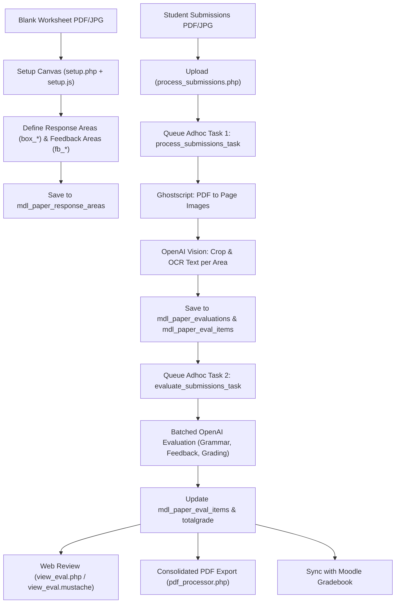

# mod_paper Developer & Architecture Guide

A comprehensive architectural and development reference for the **`mod_paper`** Moodle activity plugin.

---

## 1. Overview & Purpose

`mod_paper` allows teachers to scan paper worksheets or written student submissions (PDF or JPG), automatically detect and extract student responses using OCR/Vision bounding boxes, and generate automated AI-powered grammar corrections, feedback comments, and numerical grades via OpenAI (GPT-4o).

Teachers can review, manually adjust AI evaluations, and export a consolidated evaluation PDF with corrections and feedback positioned directly on the worksheet.

---

## 2. Core Architecture & Workflow Pipeline



### The 2-Stage Decoupled Pipeline
The submission workflow is split into two distinct background adhoc tasks:
1. **Stage 1 (`process_submissions_task.php`)**: Converts submitted multi-page PDFs into image slices using Ghostscript, crops the response areas based on percentage bounding boxes, and performs OCR text extraction via OpenAI Vision.
2. **Stage 2 (`evaluate_submissions_task.php`)**: Batches response texts to OpenAI for grammar corrections, custom qualitative feedback, and numerical scoring.
*Benefit:* Teachers can adjust prompts or click **Re-evaluate** (`re_evaluate.php`) to re-run AI evaluation without needing to re-upload or re-OCR images.

### Parallel AI Requests (`curl_multi`)

OCR is the pipeline's bottleneck: a batch costs **pages × response areas** separate Vision requests, and each one must carry its own image crop, so they cannot be collapsed into a single prompt the way stage-2 grading is. Both stages therefore fan their requests out concurrently through `openai_handler::call_openai_multi()`.

- **Runner**: a `curl_multi` loop with a queue capped at `mod_paper/openaiconcurrency` (default 16), waiting on `curl_multi_select()` rather than busy-looping. Handles map back to caller keys via `spl_object_id()` (PHP 8 returns `CurlHandle` objects, so they can't be cast to int). This is a local implementation rather than Moodle core's `\curl::multi()` — see below.
- **`submission_processor::process_batch()` runs in three phases**: (1) `build_crop_jobs()` decodes each page **once** and writes every crop to a temp file; (2) `run_ocr_jobs()` sends them all concurrently, base64-encoding each crop lazily so peak memory tracks requests in flight, not batch size; (3) `save_ocr_jobs()` writes the rows in page → `responsenumber ASC` order. Phase 3 ordering is **required**: `apply_name_field()` writes to the shared `paper_evaluations` row, so multi-name-field last-wins is only deterministic if the writes are ordered even though the OCR was not. The `paper_evaluations` row is also created in phase 3, not up front, so `external_api::check_status()`'s progress count keeps climbing.
- **`evaluation_processor::process_paper()`** collects all areas first, then grades them in one fan-out via `batch_process_evaluations_multi()`.

**Failure handling is deliberately status-aware.** `mod_minilesson`'s equivalent (`aimanager::generate_images()`) infers failure purely from the response body, which is safe for image generation but *not* for OCR: an empty result could equally mean "the response box was blank" or "the request failed". So the runner inspects `curl_multi_info_read()` errno and HTTP status, retries only transient failures (connection errors, 429, 5xx) over two backoff rounds, treats an undecodable body as an error rather than empty text, and guarantees one result entry per input key. Callers get an explicit `error` per key and never conflate it with an empty answer — a failed OCR still writes its `paper_eval_items` row (with empty `ocrtext`) rather than dropping it, which would otherwise hide the area from the review page and silently shrink `totalgrade`.

Related settings: `mod_paper/openaiconcurrency` and `mod_paper/openaitimeout` (per-request seconds, default 120; a connect timeout of 10s is fixed in code).

---

## 3. Database Schema

All tables use the `paper_` prefix:

### `mdl_paper` (Activity Instances)
| Field | Type | Description |
| :--- | :--- | :--- |
| `id` | INT(10) PK | Primary key |
| `course` | INT(10) | Course ID |
| `name` | VARCHAR(255) | Activity instance name |
| `intro` / `introformat` | TEXT / INT(4) | Activity description |
| `namefieldrole` | VARCHAR(20) | Matching role (`username` or free text) |
| `targetlanguage` | VARCHAR(50) | Target language (e.g. `English`, `ja-JP`) |
| `targetlanguagefont` | VARCHAR(50) | Font used for target language (e.g. `courier`, `freesans`) |
| `feedbacklanguage` | VARCHAR(50) | Language for feedback |
| `feedbacklanguagefont` | VARCHAR(50) | Font used for feedback text |
| `grade` | INT(10) | Maximum grade (default 100) |
| `showtotalscore` | INT(2) | Flag (0/1) whether to print total score on evaluation |

### `mdl_paper_response_areas` (Template Bounding Boxes & Prompts)
| Field | Type | Description |
| :--- | :--- | :--- |
| `id` | INT(10) PK | Primary key |
| `paperid` | INT(10) FK | Reference to `mdl_paper.id` |
| `responsenumber` | INT(10) | Area index (1, 2, 3...) |
| `areatype` | INT(2) | Role of this area — see the table below (`mod_paper\constants::M_AREATYPE_*`) |
| `box_x`, `box_y`, `box_w`, `box_h` | DECIMAL(10,2) | Response bounding box coordinates (% of page width/height) |
| `fb_x`, `fb_y`, `fb_w`, `fb_h` | DECIMAL(10,2) | Independent feedback area bounding box coordinates |
| `question` | TEXT | Question prompt / instructions |
| `correctanswer` | TEXT | Model or target correct answer |
| `correctanswermode` | VARCHAR(50) | `none`, `exactly`, `relevant`, `samemeaning` |
| `grammarcorrections` | VARCHAR(50) | `no`, `major`, `all` |
| `feedbackmode` | VARCHAR(20) | `none`, `grammatical`, `custom` |
| `feedbackinstructions` | TEXT | Custom prompt instructions for AI feedback |
| `gradingmode` | VARCHAR(20) | `none`, `incorrect`, `overall` |
| `maxgrade` | DECIMAL(10,2) | Max points for this response area |
| `gradeinstructions` | TEXT | Custom prompt instructions for AI grading |

#### Area types (`areatype`)

Declared as `mod_paper\constants::M_AREATYPE_*`. Almost no code compares these values
directly — use the predicates on `mod_paper\utils` (`is_graded_area()`, `is_name_area()`,
`is_displayonly_area()`, `has_ocr_text()`) so a new type does not mean re-auditing every
call site. The column was named `isnamefield` before version `2024042711`.

| Value | Constant | OCR? | Correction / feedback / grade | Notes |
| :--- | :--- | :--- | :--- | :--- |
| 0 | `M_AREATYPE_GRADED` | Yes | Yes | Standard response area. The only type that contributes to `maxgrade` totals and the printed total score. |
| 1 | `M_AREATYPE_NAME` | Yes | No | Free-text student name; written to `paper_evaluations.studentnametext`. Bottom-aligned when printed. |
| 2 | `M_AREATYPE_USERNAME` | Yes | No | As above, and matched against `user.username` to set `paper_evaluations.userid`. |
| 3 | `M_AREATYPE_DISPLAYONLY` | No | No | Cropped wide (`utils::pad_box()`), saved as a `responsesnippet` image and reproduced as an image rather than text. |
| 4 | `M_AREATYPE_UNGRADED` | Yes | No | Handwriting is read and printed back verbatim. Behaviour beyond this is not implemented yet. |

### `mdl_paper_evaluations` (Per-Submission Master Record)
| Field | Type | Description |
| :--- | :--- | :--- |
| `id` | INT(10) PK | Primary key |
| `paperid` | INT(10) FK | Reference to `mdl_paper.id` |
| `userid` | INT(10) | Matched Moodle User ID (or null) |
| `studentnametext` | VARCHAR(255) | OCR'd student name string |
| `totalgrade` | DECIMAL(10,2) | Computed total grade |
| `filename` | VARCHAR(255) | Original submitted file name |

### `mdl_paper_eval_items` (Per-Response-Area Results)
| Field | Type | Description |
| :--- | :--- | :--- |
| `id` | INT(10) PK | Primary key |
| `evalid` | INT(10) FK | Reference to `mdl_paper_evaluations.id` |
| `responseareaid` | INT(10) FK | Reference to `mdl_paper_response_areas.id` |
| `ocrtext` | TEXT | Raw OCR'd student response text |
| `correctedtext` | TEXT | AI grammar-corrected version |
| `feedback` | TEXT | Qualitative AI feedback string |
| `itemgrade` | DECIMAL(10,2) | Numerical score awarded for this item |

### `mdl_paper_grading_presets` & `mdl_paper_feedback_presets`
Reusable system and teacher presets for grading criteria and feedback prompts (`id`, `userid`, `name`, `content`, `timecreated`, `timemodified`). These are user-level, not tied to any `paperid`, so they are intentionally **not** included in activity backup/restore — the text they contributed already lives in `paper_response_areas`' own instruction fields once applied.

---

## 3a. Backup & Restore (`backup/moodle2/`)

Every activity module must ship a `backup_MODNAME_activity_task`/`restore_MODNAME_activity_task` pair or Moodle's `backup_factory`/`restore_factory` fatal when duplicating, backing up, or restoring the activity (this was previously missing entirely — course/activity duplication was broken). `backup_paper_stepslib.php` backs up `paper` and `paper_response_areas` unconditionally (template config, not personal data), and `paper_evaluations`/`paper_eval_items` only when the "include user data" setting is on (they're per-student submissions, mirroring how other modules gate submission data). `paper_eval_items.responseareaid` and `paper_evaluations.userid` are id-annotated so restore remaps them correctly into a new course/site. File areas `intro`, `template` (single worksheet image, itemid 0) and `responsesnippet` (per `paper_eval_items.id`) are backed up; the `submissions` filearea (raw uploaded scan batches, keyed by an ephemeral `batchid` no DB row references after processing) and `downloadevaluations` (generated on-the-fly by `pdf_processor`, not a stored file) are deliberately excluded.

---

## 4. Key Components & Directory Map

```
public/mod/paper/
├── backup/moodle2/
│   ├── backup_paper_activity_task.class.php    # Registers the paper backup step
│   ├── backup_paper_stepslib.php               # Defines backup XML structure + file/id annotations
│   ├── restore_paper_activity_task.class.php   # Registers the paper restore step
│   └── restore_paper_stepslib.php              # Rebuilds tables/FKs and re-attaches files on restore
├── amd/src/
│   ├── setup.js            # HTML5 Canvas UI for drawing & configuring response/feedback boxes
│   ├── view_eval.js        # Interactive teacher review page (live inline editing & recalculation)
│   └── reports.js          # Submissions list table handling and bulk actions
├── classes/
│   ├── ai_manager.php      # Abstraction layer for AI providers
│   ├── openai_handler.php  # GPT-4o API client (Vision OCR, batch evaluation, prompt structuring)
│   ├── pdf_processor.php   # Ghostscript PDF->JPG slicing & TCPDF evaluation PDF generation
│   ├── diff.php            # Word-level diff engine (character/word matching)
│   ├── utils.php           # Diff formatting, font mappers, preset helpers, box coordinate geometry
│   ├── task/
│   │   ├── process_submissions_task.php   # Adhoc task: PDF bursting, cropping, OCR
│   │   └── evaluate_submissions_task.php  # Adhoc task: Batched AI grading and feedback
│   └── form/
│       ├── preset_form.php                # Grading preset add/edit form
│       ├── feedback_preset_form.php       # Feedback preset add/edit form
│       └── process_submissions_form.php   # Multi-file submission upload form
├── templates/
│   ├── view_page.mustache                 # Teacher/Student main view page
│   ├── setup.mustache                     # Worksheet configuration canvas layout
│   ├── reports_page.mustache              # Submissions report list
│   ├── view_eval.mustache                 # Single submission review & edit interface
│   └── eval_item_content.mustache         # Item-level diff & feedback rendering block
├── samples/
│   ├── test_worksheet.pdf                 # Sample blank worksheet template
│   └── test_worksheet_submissions.pdf     # Sample multi-page completed student worksheets
├── presets.php             # Preset manager page for grading and feedback templates
├── process_submissions.php # Submission upload handler and background task dispatcher
├── re_evaluate.php         # Re-evaluation trigger endpoint
├── reports.php             # Submissions report page
├── setup.php               # Template area setup page
├── view_eval.php           # Individual evaluation review and manual editing controller
├── settings.php            # Admin global plugin settings (API key, ghostscript path, font defaults)
└── mod_form.php            # Activity instance creation form
```

---

## 5. UI & Rendering Engine

### A. Setup Canvas (`amd/src/setup.js`)
- Uses HTML5 `<canvas>` overlaid on top of the worksheet JPG.
- Supports dual bounding boxes per item:
  - **Red Bounding Box (`box_*`)**: Response area for student handwriting/text OCR.
  - **Blue/Green Bounding Box (`fb_*`)**: Dedicated location where feedback text is written on the final PDF.
- If no custom feedback box is drawn, `utils::get_effective_feedback_box()` defaults to positioning the feedback below or adjacent to the response box.

### B. Grammar Corrections Diff (`classes/diff.php` & `classes/utils.php`)
- Computes word-level diffs between raw OCR text and corrected text.
- Generates HTML with red strikethrough (`<span class="paper_del">`) for mistakes and green bold (`<span class="paper_ins">`) for corrections.

### C. Review Sidebar (`view_eval.php` + `amd/src/view_eval.js`)
Clicking a response area on the worksheet opens an editing sidebar backed by two web service calls in `classes/external/external_api.php`:

- **`mod_paper_update_eval_item`** saves grade, original (OCR) text, corrected text and feedback. Both texts are editable: the printed correction is `utils::build_combined_diff($ocrtext, $correctedtext)`, so a misread word would otherwise show up as a correction the student never needed. Sending `ocrtext` as `null` leaves the stored text untouched, which is what a display-only area (no OCR text of its own) does.
- **`mod_paper_reevaluate_eval_item`** is the single-item counterpart of `re_evaluate.php`: it puts one item back into the pending state (NULL `correctedtext`/`feedback`/`itemgrade`), then calls `evaluation_processor::evaluate_area()` **synchronously** rather than queueing the adhoc task, so the teacher sees the new result immediately. Any OCR text sent with the call is saved first, so an unsaved sidebar fix is what gets graded. If the AI returns nothing the item is deliberately left pending, so the next scheduled evaluation run retries it. `evaluate_area()` reports progress with `mtrace()`, which echoes into the response body outside CLI — the call is wrapped in `ob_start()`/`ob_end_clean()` to keep it out of the JSON.

Grades are held to the response area's `maxgrade` in both places: `view_eval.php` passes it through as `data-maxgrade` for the `max` attribute on the input, and `external_api::clamp_grade()` clamps server-side, since a web service cannot trust the widget. A NULL `maxgrade` (only possible on rows not created by `setup.php`) means no maximum was ever configured and is left uncapped.

Editing a name/username area writes back to `paper_evaluations.studentnametext`, falling back to the OCR text when there is no corrected text — name areas never reach stage 2, so the teacher's fix normally lands in the OCR box. A corrected username re-links `paper_evaluations.userid`, the same way `submission_processor::apply_name_field()` does on first OCR.

### D. PDF Generation (`classes/pdf_processor.php`)
- Uses TCPDF loaded via Moodle core.
- Loads the original blank worksheet background image.
- Prints student name at top.
- Writes corrected text and feedback inside designated bounding boxes (`fb_*`) using configured fonts (`targetlanguagefont`, `feedbacklanguagefont`).

---

## 6. Past Development History & Conversation Log

When referencing past work or decisions, use these Conversation IDs from the history:

| Date | Conversation ID | Key Milestones & Implemented Features |
| :--- | :--- | :--- |
| **2026-04-18** | `5c60f52c-ce26-42f9-a3e8-bd985a320d01` | **Pipeline Separation**: Decoupled OCR upload from AI evaluation into two adhoc tasks. Added PDF upload in setup. Implemented batched OpenAI evaluation. |
| **2026-04-26** | `cfe7db2c-1c89-47e3-a84c-87156557ceb3` | **Configurable Fonts & Status Icons**: Added `targetlanguagefont` and `feedbacklanguagefont` (Courier, FreeSans, Helvetica, Times, KozMinProRegular, STSongStdLight). Added response area setup status indicators. |
| **2026-04-27** | `5fb25941-f177-4f7f-b668-b200536ff61f` | **Web Service API Fix**: Resolved namespace and inheritance with `external_api`. |
| **2026-04-27** | `2642e3c4-25da-48dc-8934-2989c06d1835` | **Grading/Feedback Refactor & Mustache Migration**: Separated `gradingmode` from `feedbackmode`. Added preset grading prompts. Migrated `view.php`, `reports.php`, and `view_eval.php` to Mustache templates. Added teacher live score editing. |
| **2026-04-28** | `860bae78-059c-46dc-a371-836b17f433db` | **Feedback Presets & Feedback Boxes**: Created `paper_feedback_presets` table and management UI. Added independent feedback bounding boxes (`fb_*`) in setup canvas and PDF renderer. |

---

## 7. Developer Cheatsheet & CLI Commands

### Run Adhoc Tasks Manually
To execute queued submission processing or evaluation immediately without waiting for cron:
```bash
# Process uploads, burst PDF, crop, and run OCR
php public/admin/cli/adhoc_task.php --execute=\\mod_paper\\task\\process_submissions_task

# Run AI evaluation, feedback generation, and grade calculation
php public/admin/cli/adhoc_task.php --execute=\\mod_paper\\task\\evaluate_submissions_task
```

### Compile AMD Javascript
When modifying files in `amd/src/` (`setup.js`, `view_eval.js`, `reports.js`):
```bash
# From moodle root directory
npx grunt amd --components=mod_paper
```

### Purge Moodle Caches
```bash
php public/admin/cli/purge_caches.php
```

### Database Upgrades
When adding or altering fields in `db/install.xml` and `db/upgrade.php`:
1. Increment the version number in `version.php`.
2. Run:
```bash
php public/admin/cli/upgrade.php --non-interactive
```
